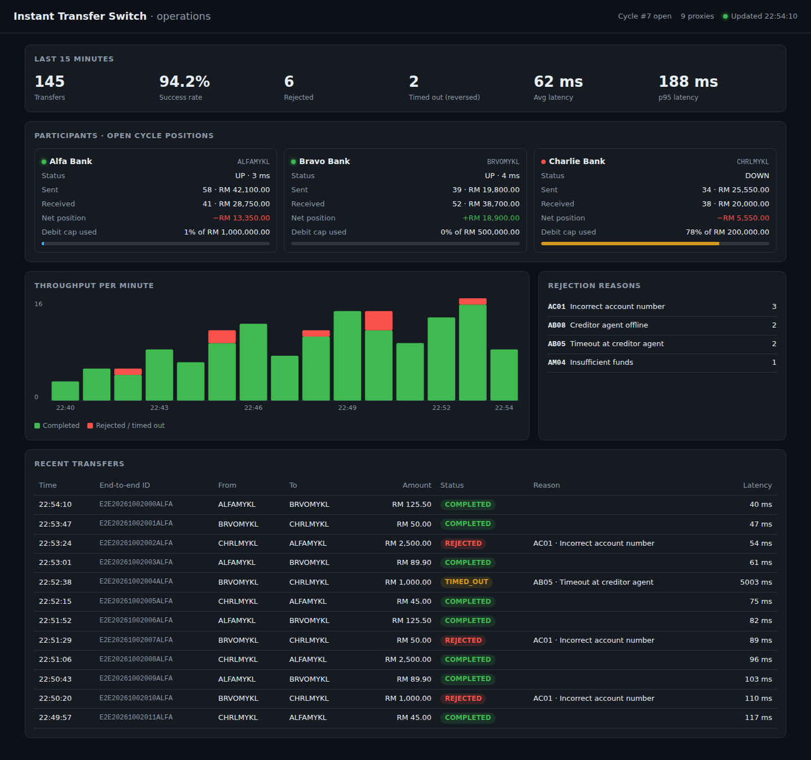
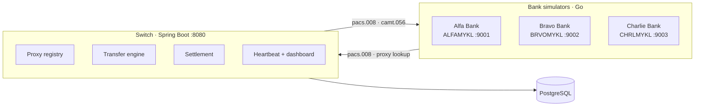
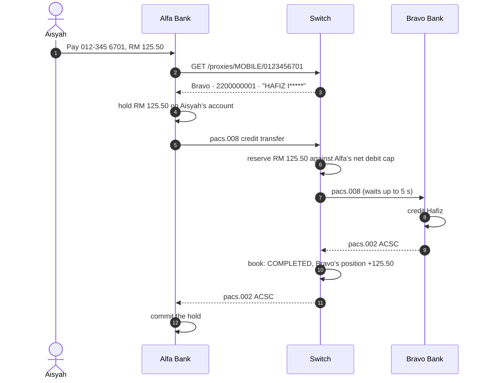
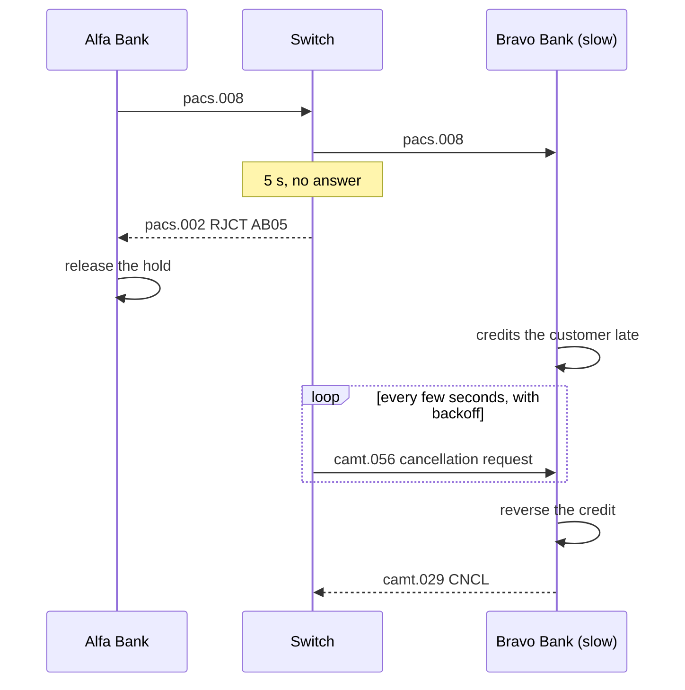

# Instant Transfer Switch


A small **real-time interbank payment switch**, in the style of Malaysia's DuitNow: banks send each other money in
seconds, addressed by a phone number or IC number, and settle what they owe each other once a day.

- **Switch** (Java 21, Spring Boot): routes ISO 20022 transfers between banks, enforces each bank's net debit cap,
  handles timeouts with automatic reversals, runs end-of-day settlement, and serves a live operations dashboard.
- **Bank simulator** (Go, standard library only): one binary that plays any bank. It keeps customer accounts, sends and
  receives transfers, reconciles against the switch, and can be made slow or offline on purpose.

`docker compose up` starts the switch, PostgreSQL and three banks; `scripts/demo.sh` walks through every scenario.

> A portfolio project inspired by how national instant-payment schemes work. It isn't affiliated with any real scheme,
> and the banks, BICs and customers are made up.



## Architecture



### A transfer, step by step



### When the receiving bank is too slow

The sender can't be left waiting, so after 5 seconds the switch answers **RJCT AB05** and the sending bank returns the
money to its customer. The receiving bank may still credit its customer moments later, so the switch keeps sending it a
**camt.056** cancellation until it confirms with a **camt.029**: CNCL (credit reversed) or RJCR (nothing was credited).



## ISO 20022 messages

| Message | Direction | Used for |
|---|---|---|
| `pacs.008.001.08` FI to FI Customer Credit Transfer | bank → switch → bank | the transfer itself |
| `pacs.002.001.10` Payment Status Report | bank → switch → bank | ACSC (completed) or RJCT with a reason code |
| `camt.056.001.08` Payment Cancellation Request | switch → bank | undo a credit after a timeout |
| `camt.029.001.09` Resolution of Investigation | bank → switch | CNCL (reversed) or RJCR (nothing to cancel) |

### Reason codes

| Code | Meaning here | Raised by |
|---|---|---|
| `AC01` | Incorrect account number | receiving bank |
| `AC04` | Account closed | receiving bank |
| `AM04` | Sending bank's net debit cap reached | switch |
| `AB05` | Receiving bank didn't answer in time (transfer is reversed) | switch |
| `AB08` | Receiving bank offline | switch (heartbeat) |
| `RC01` | Unknown receiving bank | switch |
| `FF01` | Invalid message | switch / bank |

## Design notes

**Net debit cap.** Banks don't settle each transfer as it happens; they settle the net once a day. Until then, the
switch is trusting each bank to pay up, so every bank has a cap on how far into debit it can go within a cycle. The
check is a single conditional `UPDATE`, so concurrent transfers can never push a bank past its cap together:

```sql
UPDATE positions SET sent_amount = sent_amount + :amount, sent_count = sent_count + 1
 WHERE cycle_id = :cycle AND bic = :bic AND received_amount - sent_amount - :amount + :cap >= 0
```

**Idempotency.** A bank that loses an answer simply sends the same pacs.008 again. Transfers are unique on
`(debtor_bic, end_to_end_id)`, so a retry gets the stored pacs.002 back and no money moves twice. A bank can also ask
for the status of a transfer (`GET /api/v1/iso/pacs.002/{endToEndId}`), which the Go bank does whenever a send fails.

**No locks across the network.** The reservation and the booking are two short database transactions; the call to the
receiving bank happens between them, so a slow bank never holds a lock.

**Settlement cut-over.** Transfers take the open cycle with `FOR SHARE`; closing takes it `FOR UPDATE`. The close marks
the cycle CLOSING and opens the next one in one transaction, so new transfers flow into the new cycle without a pause.
It then waits for transfers still in flight in the old cycle, nets every bank's position (received minus sent), checks
the nets **add up to zero**, and stores the report. A cron closes the cycle at 23:59 Malaysia time; operators can also
close it on demand.

**Reconciliation.** Each bank fetches its settled transactions for a cycle from the switch and compares them with its
own ledger, reporting any break (for example, a credit the switch never confirmed).

**Heartbeats.** The switch pings every bank's `/health` every 3 seconds. Transfers to a bank that's down are rejected
at once with AB08 instead of making the sender wait for a timeout.

**Money** is an integer number of sen everywhere: `BIGINT` in PostgreSQL, `long` in Java, `int64` in Go. The XML
parser has DTDs and external entities disabled (XXE).

## Running it

Needs Docker Desktop.

```bash
docker compose up -d --build     # switch on :8080, banks on :9001-9003, PostgreSQL on :5432
./scripts/demo.sh                # needs bash and curl (Git Bash works on Windows)
```

Open **http://localhost:8080** for the dashboard while the demo runs. The demo:

1. looks up a mobile number and shows the masked name,
2. pays by mobile number and by account number,
3. sends to a wrong account (AC01),
4. makes Bravo slow, so the switch times out (AB05) and reverses the late credit,
5. takes Charlie offline (AB08),
6. closes the settlement cycle and checks the nets sum to zero,
7. has every bank reconcile its ledger against the switch.

Stop with `docker compose down` (add `-v` to wipe the database).

### Try it by hand

Each bank has two demo customers; their mobile numbers are registered with the switch on start-up.

| Bank | Account | Customer | Mobile |
|---|---|---|---|
| Alfa | 1100000001 | Aisyah Rahman | 012-345 6701 |
| Bravo | 2200000001 | Hafiz Ismail | 019-876 5401 |
| Charlie | 3300000001 | Arjun Kumar | 017-111 2201 |

```bash
# Aisyah pays Hafiz by phone number
curl -X POST localhost:9001/transfers -H 'Content-Type: application/json' \
  -d '{"fromAccount":"1100000001","proxyType":"MOBILE","proxyValue":"0198765401","amount":"25.00"}'

curl localhost:9002/accounts/2200000001                           # Hafiz's balance (sen)
curl -X POST localhost:9002/admin/chaos -d '{"delayMs":7000}'     # make Bravo slow ({"offline":true} for down)
curl -X POST localhost:8080/api/v1/settlement/close -H 'X-Admin-Key: local-admin-key'
curl localhost:9001/admin/reconcile/1
```

## API

### Switch (`:8080`)

Banks authenticate with `X-Participant: <BIC>` and `X-Api-Key`; settlement close needs `X-Admin-Key`.

| Method | Path | |
|---|---|---|
| `POST` | `/api/v1/proxies` | register a mobile / NRIC / business ID to one of your accounts |
| `GET` | `/api/v1/proxies/{type}/{value}` | resolve a proxy to bank, account and masked name |
| `DELETE` | `/api/v1/proxies/{type}/{value}` | remove your registration |
| `POST` | `/api/v1/iso/pacs.008` | send a credit transfer (XML in, pacs.002 XML out) |
| `GET` | `/api/v1/iso/pacs.002/{endToEndId}` | status of a transfer you sent |
| `GET` | `/api/v1/settlement/cycles/{id}/transactions` | your settled transactions, for reconciliation |
| `POST` | `/api/v1/settlement/close` | close the open cycle (admin) |
| `GET` | `/api/v1/settlement/cycles`, `/cycles/{id}` | cycles and settlement reports |
| `GET` | `/api/v1/monitor/summary` | the numbers behind the dashboard |

### Bank simulator (`:9001`–`:9003`)

| Method | Path | |
|---|---|---|
| `GET` | `/accounts`, `/accounts/{number}` | balances (in sen) |
| `GET` | `/lookup/{type}/{value}` | proxy lookup through the switch |
| `POST` | `/transfers` | pay by proxy (`proxyType`, `proxyValue`) or by `toBic` + `toAccount` |
| `GET` | `/transfers` | this bank's transfers |
| `POST` | `/iso/pacs.008`, `/iso/camt.056` | called by the switch |
| `POST` | `/admin/chaos` | `{"delayMs": 7000, "rejectAll": false, "offline": false}` |
| `GET` | `/admin/reconcile/{cycle}` | compare the ledger with the switch for a cycle |

## Tests

```bash
cd bank && go test -race ./...           # ISO messages, ledger, the bank's send/receive flows against a fake switch
cd switch && mvn verify                   # unit tests
ITS_TEST_DB_URL=jdbc:postgresql://localhost:5432/switch mvn verify   # + the full switch against PostgreSQL
```

- **Bank (Go):** amount parsing, message round trips, holds and idempotent credits, reversals, on-us transfers, lost
  answers resolved through a status query, chaos modes, reconciliation breaks.
- **Switch (Java):** money parsing, ISO parsing and writing (with messages produced by the Go bank as fixtures, so
  the two sides stay compatible), XXE refusal, proxy normalisation and masking, netting. The integration test runs the
  real switch with a fake receiving bank: proxy registration and lookup, completed and repeated transfers, AC01, AB08,
  RC01, AM04, a timeout followed by a camt.056, and a settlement close.
- **CI** runs both, then starts everything with Docker Compose and runs `scripts/demo.sh` end to end.

## Project structure

```
switch/                     Spring Boot switch
  src/main/java/com/its/
    iso/                    pacs.008 / pacs.002 / camt.056 / camt.029, money in sen
    proxy/                  proxy registry, normalisation, name masking
    transfer/               transfer engine, creditor bank client, reversal job
    settlement/             cycles, net debit caps, netting, end-of-day close
    monitor/                heartbeats and the dashboard API
    participant/, web/      bank registry, API-key auth, error handling
  src/main/resources/
    static/index.html       operations dashboard
    db/migration/           Flyway schema
bank/                       Go bank simulator
  cmd/bank/                 entry point and demo customers
  internal/iso/             ISO 20022 messages
  internal/ledger/          accounts, holds, idempotent credits
  internal/server/          HTTP API, outbound and inbound transfers, reconciliation
  internal/switchclient/    client for the switch
scripts/demo.sh             end-to-end tour
docker-compose.yml          PostgreSQL, the switch and three banks
```

## Roadmap

- Request-to-pay (pain.013 / pain.014)
- Mutual TLS and signed messages between banks and the switch
- Kafka for the audit trail and dashboard events
- Prometheus metrics and Grafana dashboards
- Liquidity top-ups that raise a bank's cap during the day

## License

[MIT](LICENSE)
